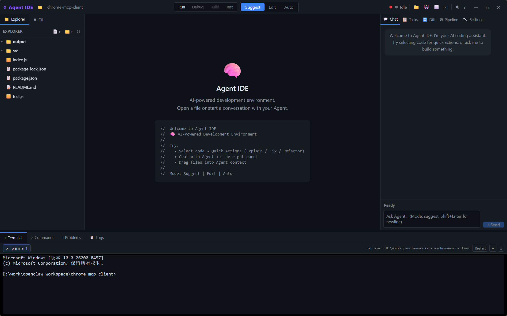

# Agent IDE

中文文档见 [README.zh-CN.md](README.zh-CN.md).

Code-centric controllable AI Agent IDE built with Tauri v2, Rust, React, TypeScript, Tailwind CSS, Monaco Editor, and xterm.js.

Agent IDE is not intended to be a chat-only coding tool. The product direction is an IDE where the Agent is visible, auditable, and user-controlled through task plans, role pipelines, diff review, logs, Git state, and terminal workflows.



## Current Status

Phase 7 is feature-complete. Phase 8 is focused on daily IDE replacement hardening.

Capability snapshot:

- Desktop IDE shell: Monaco editor, Explorer, Git, Terminal, Problems, Logs, Commands, and Agent panels.
- Agent loop: role pipeline, editable plan, context preview/budgeting, structured action logs, `agent-changes` protocol, and diff review/apply/regenerate.
- Project memory: workspace-root `AGENTS.md` is loaded into Agent context (bounded, budget-aware, IDE + CLI).
- Semantic/runtime loop: TypeScript/JavaScript and Go LSP first pass, diagnostics to Problems/editor markers, project command run history, and terminal failure context for Agent repair.
- Automation/release: headless `agent_cli` first pass and Windows packaging workflow.

The detailed implementation state, remaining gaps, and next tasks live in [ROADMAP.md](ROADMAP.md). Design and protocol docs: [docs/agent_ide_design.md](docs/agent_ide_design.md), [docs/agent_changes_schema.md](docs/agent_changes_schema.md), and [docs/smoke_test.md](docs/smoke_test.md).

## Runtime Modes

There are two different development modes:

```powershell
npm run dev
```

Runs Vite web preview only. Tauri IPC, filesystem, terminal, Git, and Agent backend features are disabled or guarded.

```powershell
npm run tauri -- dev
```

Runs the real desktop IDE with the Rust backend and Tauri APIs.

## Setup

### Prerequisites

Before you begin, ensure you have the following installed:

#### Required

- **Node.js** (v18 or higher) and npm
  - Download: https://nodejs.org/
  - Verify: `node --version` and `npm --version`

- **Rust toolchain** (latest stable)
  - **Windows**: Download and run [rustup-init.exe](https://rustup.rs/)
  - **macOS**: Run `curl --proto '=https' --tlsv1.2 -sSf https://sh.rustup.rs | sh`
  - **Linux**: Run `curl --proto '=https' --tlsv1.2 -sSf https://sh.rustup.rs | sh`
  - Verify: `rustc --version` and `cargo --version`

#### Tauri v2 Prerequisites

**Windows:**
- Microsoft Visual C++ Build Tools 2015 or later
- WebView2 Runtime (usually included with Windows 10/11)
- OpenSSL (for some dependencies)

**macOS:**
- Xcode Command Line Tools: `xcode-select --install`
- CocoaPods: `sudo gem install cocoapods`

**Linux:**
- WebKitGTK development libraries
- libayatana-appindicator development libraries
- OpenSSL development libraries

### Installation Steps

#### 1. Install Rust (if not already installed)

**Windows:**
```powershell
# Download and run rustup installer
# Visit: https://rustup.rs/
# Or use PowerShell:
Invoke-WebRequest -Uri https://win.rustup.rs/x86_64 -OutFile rustup-init.exe
.\rustup-init.exe
```

**macOS/Linux:**
```bash
curl --proto '=https' --tlsv1.2 -sSf https://sh.rustup.rs | sh
source $HOME/.cargo/env
```

#### 2. Verify Rust Installation

```powershell
rustc --version
cargo --version
```

Expected output:
```
rustc 1.80.0 (or later)
cargo 1.80.0 (or later)
```

#### 3. Install Tauri Prerequisites

**Windows:**
```powershell
# Install Visual Studio Build Tools
# Download from: https://visualstudio.microsoft.com/visual-cpp-build-tools/
# Select "Desktop development with C++" workload

# Install WebView2 (if not present)
# Download from: https://developer.microsoft.com/en-us/microsoft-edge/webview2/
```

**macOS:**
```bash
# Install Xcode Command Line Tools
xcode-select --install

# Install CocoaPods
sudo gem install cocoapods
```

**Linux (Ubuntu/Debian):**
```bash
sudo apt update
sudo apt install libwebkit2gtk-4.0-dev \
    libayatana-appindicator3-dev \
    librsvg2-dev \
    openssl-dev \
    libssl-dev \
    curl \
    wget \
    file \
    libxdo-dev \
    libxcb-dev
```

#### 4. Install Frontend Dependencies

```powershell
npm install
```

#### 5. Verify Installation

```powershell
# Verify Node.js and npm
node --version
npm --version

# Verify Rust and Cargo
rustc --version
cargo --version

# Verify Tauri CLI
npm run tauri -- --version
```

### Running the Application

#### Web Preview Mode (Frontend Only)

```powershell
npm run dev
```

This runs Vite web preview only. Tauri IPC, filesystem, terminal, Git, and Agent backend features are disabled or guarded.

**Use this for:**
- Frontend development and testing
- UI/UX changes
- When Rust backend is not required

#### Desktop IDE Mode (Full Application)

```powershell
npm run tauri -- dev
```

This runs the real desktop IDE with the Rust backend and Tauri APIs.

**Use this for:**
- Full application development
- Testing Agent functionality
- File system operations
- Terminal integration
- Git operations

**Note:** This command requires a properly installed Rust toolchain. If you see `cargo: command not found` or similar errors, please refer to the Troubleshooting section below.

## Troubleshooting

### Rust/Cargo Not Found

**Error:**
```
failed to run 'cargo metadata' command to get workspace directory: failed to run command cargo metadata --no-deps --format-version 1: program not found
```

**Quick Fix Scripts:**

We provide two automatic fix scripts:

**PowerShell Version (Recommended):**
```powershell
.\fix-environment.ps1
```

**Batch Version (Alternative):**
```powershell
.\fix-environment.bat
```

These scripts will automatically:
- Check Node.js and npm installation
- Check Rust and Cargo installation
- Download and install Rust if needed
- Fix PATH configuration
- Verify installation

**Manual Solutions:**

1. **Install Rust:**
   ```powershell
   # Windows
   Invoke-WebRequest -Uri https://win.rustup.rs/x86_64 -OutFile rustup-init.exe
   .\rustup-init.exe

   # macOS/Linux
   curl --proto '=https' --tlsv1.2 -sSf https://sh.rustup.rs | sh
   ```

2. **Restart your terminal** (important!)

3. **Verify installation:**
   ```powershell
   rustc --version
   cargo --version
   ```

4. **Add Cargo to PATH** (if still not found):

   **Windows (PowerShell):**
   ```powershell
   # Add to current session
   $env:PATH += ";$env:USERPROFILE\.cargo\bin"

   # Add permanently (run as Administrator)
   [Environment]::SetEnvironmentVariable(
       "Path",
       [Environment]::GetEnvironmentVariable("Path", "User") + ";$env:USERPROFILE\.cargo\bin",
       "User"
   )
   ```

   **macOS/Linux:**
   ```bash
   # Add to ~/.bashrc or ~/.zshrc
   echo 'export PATH="$HOME/.cargo/bin:$PATH"' >> ~/.bashrc
   source ~/.bashrc
   ```

### Node.js Version Issues

**Error:**
```
Error: Node.js version too old. Requires v18 or higher.
```

**Solution:**
```powershell
# Install Node.js 18+ using nvm (recommended)
# Windows: Download from https://github.com/coreybutler/nvm-windows/releases
# macOS/Linux:
curl -o- https://raw.githubusercontent.com/nvm-sh/nvm/v0.39.0/install.sh | bash
nvm install 18
nvm use 18
```

### Tauri Build Errors

**Error:**
```
error: failed to run custom build command for `openssl-sys`
```

**Solution:**
```powershell
# Windows: Install OpenSSL
# Download from: https://slproweb.com/products/Win32OpenSSL.html
# Install to C:\Program Files\OpenSSL-Win64

# Set environment variable
$env:OPENSSL_DIR = "C:\Program Files\OpenSSL-Win64"
```

**Error:**
```
error: linker `link.exe` not found
```

**Solution:**
```powershell
# Install Visual Studio Build Tools
# Download from: https://visualstudio.microsoft.com/visual-cpp-build-tools/
# Select "Desktop development with C++" during installation
```

### Permission Issues

**Error:**
```
Error: EACCES: permission denied
```

**Solution:**
```powershell
# macOS/Linux: Fix npm permissions
mkdir -p ~/.npm-global
npm config set prefix '~/.npm-global'
echo 'export PATH=~/.npm-global/bin:$PATH' >> ~/.bashrc
source ~/.bashrc
```

### Port Already in Use

**Error:**
```
Error: Port 1420 is already in use
```

**Solution:**
```powershell
# Windows: Find and kill the process
netstat -ano | findstr :1420
taskkill /PID <PID> /F

# macOS/Linux:
lsof -ti:1420 | xargs kill -9
```

### Cargo Build Cache Issues

**Error:**
```
error: failed to compile
```

**Solution:**
```powershell
# Clean cargo cache
cargo clean

# Update Rust toolchain
rustup update

# Rebuild
npm run tauri -- dev
```

### WebView2 Missing (Windows)

**Error:**
```
Error: WebView2 runtime not found
```

**Solution:**
```powershell
# Download and install WebView2 Runtime
# https://developer.microsoft.com/en-us/microsoft-edge/webview2/

# Or use Windows Update to get the latest WebView2
```

### Development Environment Issues

**Common Issues:**
1. **Hot reload not working**: Ensure you're running `npm run tauri -- dev`, not just `npm run dev`
2. **Styles not loading**: Clear browser cache and restart dev server
3. **Extensions not working**: Check browser console for errors and ensure Tauri APIs are available

### Getting Help

If you encounter issues not covered here:

**Quick Fix Scripts:**
```powershell
# PowerShell version (recommended)
.\fix-environment.ps1

# Or batch version
.\fix-environment.bat
```

These scripts will automatically:
- Check Node.js and npm installation
- Check Rust and Cargo installation
- Download and install Rust if needed
- Fix PATH configuration
- Verify installation

1. Check the [Tauri documentation](https://tauri.app/v1/guides/)
2. Review [Rust installation guide](https://www.rust-lang.org/tools/install)
3. Check [Node.js documentation](https://nodejs.org/en/docs/)
4. Open an issue on GitHub with:
   - Your operating system and version
   - Node.js and npm versions
   - Rust and Cargo versions
   - Complete error message
   - Steps to reproduce

## Verification

Run these checks before committing substantial changes:

```powershell
npm run build
npm test
cd src-tauri
cargo check
cargo test
```

Known build note: Vite currently warns about a large chunk because Monaco, Markdown, xterm, and syntax tooling are bundled together. This is not a correctness failure.

For changes to LSP, Problems, Terminal, Git, or Agent diff application, also run the real Tauri runtime checklist in [docs/smoke_test.md](docs/smoke_test.md).

## Windows Packaging

Build a Windows installer package:

```powershell
npm run package:windows
```

The script runs frontend build/tests, `cargo check`, `cargo test`, and `tauri build --bundles nsis,msi`, then copies installers to `release/windows/<version>/` with `SHA256SUMS.txt` and `manifest.json`.

For a local packaging smoke after checks have already passed:

```powershell
npm run package:windows:fast
```

To build one installer format:

```powershell
npm run package:windows:nsis
npm run package:windows:msi
```

The first Windows bundle may download NSIS, `nsis_tauri_utils.dll`, and/or WiX tooling through Tauri. If local bundling times out while downloading those tools, rerun the command after the tool cache is populated or run the `Windows Package` GitHub Actions workflow, which builds on `windows-latest` and uploads the generated artifacts.

Generated release artifacts are intentionally ignored by Git.

## Project Structure

```text
src/
  components/
    agent/       Agent chat, task, diff, pipeline, settings UI
    editor/      Monaco editor, tabs, overlays, quick actions
    layout/      top/left/right/bottom layout panels
    panels/      Explorer, Git, Terminal, Logs
  hooks/         Tauri event bridge and shortcuts
  stores/        Zustand stores
  types/         frontend DTOs
  utils/         Tauri runtime helpers

src-tauri/
  src/
    agent/       planner, executor, orchestrator, diff apply, roles
    commands/    Tauri IPC commands for fs/git/terminal/agent
    services/    workspace, context, LLM client
    bin/         agent_cli

docs/
  agent_ide_design.md      detailed current design
  agent_cli_manual.md      CLI mode usage and limitations
  agent_cli_design.md      CLI automation and integration target design
  agent_ide_plan.md        original technical plan
  agent_ide_ui_design.md   product UI design target
```

## Agent Workflow

Agent IDE uses the chat UI as the user entry point, but the Agent is scheduled by the IDE runtime rather than by a single free-form chat loop.

```text
Chat prompt
  -> ChatView collects prompt, active file, selection, and attached context files
  -> useAgentStore.sendPrompt() invokes send_agent_prompt over Tauri IPC
  -> commands/agent.rs builds AgentContext and reads the configured pipeline
  -> services/context.rs enriches and compresses context
  -> agent/orchestrator.rs runs the Agent state machine
  -> planner produces task steps
  -> role pipeline executes configured stages
     -> architect
     -> coder
     -> tester
     -> reviewer
  -> executor streams LLM output through services/llm_client.rs
  -> diff parser converts model output into pending diffs
  -> reviewer receives actual pending diff summaries
  -> useAgentBridge receives backend events and refreshes Chat/Tasks/Pipeline/Diff/Logs
  -> user applies/rejects diffs through commands/agent.rs and agent/diff_apply.rs
```

The main scheduling modules are:

| Layer | Module | Responsibility |
|-------|--------|----------------|
| UI | `src/components/agent/*` | Chat input, task view, pipeline view, diff review, settings. |
| Frontend state | `src/stores/useAgentStore.ts` | Agent state, IPC calls, messages, steps, diffs, pipeline config. |
| Event bridge | `src/hooks/useAgentBridge.ts` | Subscribes to backend events and updates Zustand stores. |
| IPC boundary | `src-tauri/src/commands/agent.rs` | Validates requests, builds context, starts/stops Agent runs, applies/rejects diffs. |
| Context | `src-tauri/src/services/context.rs` | Adds active file, selection, open files, project tree, Git diff, and compression mode. |
| Orchestration | `src-tauri/src/agent/orchestrator.rs` | Runs planner, role stages, reviewer, action logs, and Agent state transitions. |
| Role execution | `src-tauri/src/agent/executor.rs` | Sends role-specific prompts to the LLM and streams responses. |
| LLM | `src-tauri/src/services/llm_client.rs` | OpenAI-compatible streaming chat client. |
| Diff apply | `src-tauri/src/agent/diff_apply.rs` | Applies reviewable file changes inside the workspace boundary. |

Context compression is selected per Chat run:

| Mode | Use |
|------|-----|
| `focused` | Default practical mode: selection, active-file excerpt, project summary, Git diff. |
| `compact` | Lower-token mode: outline and metadata for broad context. |
| `budgeted` | Token-budget-aware packing that uses provider profile budget metadata or a safe default budget. |
| `full` | Maximum-fidelity mode: complete active context when accuracy matters more than token use. |

Agent events are streamed back to the UI and action log:

- `agent-state-changed`
- `agent-stream-token`
- `agent-plan-ready`
- `agent-step-update`
- `agent-pipeline-update`
- `agent-diff-ready`
- `agent-action-log`

For the full design, read [docs/agent_ide_design.md](docs/agent_ide_design.md), especially sections 4.3 Agent Prompt, 4.4 Agent Pipeline, 5 Context Model, and 6 Agent Modes and Safety. The structured change protocol is documented in [docs/agent_changes_schema.md](docs/agent_changes_schema.md).

## Agent Change Protocol

Preferred structured output:

````text
```agent-changes
{
  "version": 1,
  "changes": [
    {
      "type": "edit",
      "file": "path/to/file",
      "baseHash": "optional current file hash when known",
      "rationale": "why this change is needed",
      "hunks": [
        { "original": "exact existing code", "updated": "replacement code" }
      ]
    },
    {
      "type": "create",
      "file": "path/to/new-file",
      "rationale": "why this file is needed",
      "content": "complete file content"
    }
  ],
  "findings": [
    {
      "severity": "warning",
      "file": "path/to/file",
      "hunkIndex": 0,
      "message": "optional reviewer finding tied to this hunk"
    }
  ]
}
```
````

Legacy `diff:path` and `new:path` code blocks are still supported. Schema details and validation behavior are documented in [docs/agent_changes_schema.md](docs/agent_changes_schema.md).

## Project Memory

If an `AGENTS.md` file exists at the workspace root, Agent IDE loads it as project memory for every Agent run, in both the desktop IDE and `agent_cli`.

- Content is injected as a bounded `Project memory (AGENTS.md)` context section and participates in all compression modes and token budget packing.
- It is included by default. Per-run context source controls can exclude it (`includeProjectMemory`), and the CLI can select it with `--include project-memory`.
- Oversized files are trimmed at 8,000 characters with a truncation marker.

This keeps persistent project conventions, preferred commands, and constraints versioned inside the workspace itself, following the cross-tool `AGENTS.md` convention.

## Configuration

LLM config can be provided through the UI or environment variables:

```powershell
$env:LLM_ENDPOINT = "https://api.openai.com/v1"
$env:LLM_API_KEY = "..."
$env:LLM_MODEL = "..."
```

Current local config files are stored under `~/.agent-ide` unless `AGENT_IDE_CONFIG_DIR` is set.

## CLI

The Rust side includes a headless automation CLI:

```powershell
cd src-tauri
cargo build --bin agent_cli --release
target\release\agent_cli --help
```

CLI mode is first-pass complete for headless automation. It supports `doctor`, `context estimate`, `plan`, `run`, and `smoke ide-backend`; text/JSON/NDJSON output; run artifacts; optional apply; project command checks; bounded repair iterations; command allow-listing; timeout/output/diff limits; and smoke-tested `project-tasks.json`, `problems.json`, `repair-chain.json`, and `repair-summary.json` artifacts.

It is intentionally not a full command-line IDE replacement. Visual Agent plan controls, Problems/Terminal/Git integration, LSP views, run history, and per-hunk review UI remain desktop IDE workflows.

See [docs/agent_cli_manual.md](docs/agent_cli_manual.md) for usage, safety notes, and the current completeness assessment. See [docs/agent_cli_design.md](docs/agent_cli_design.md) for the planned toolchain-integration and full-automation architecture.

## Git Notes

This repo may have local demo changes. Check status before staging:

```powershell
git status --short
```

Do not include unrelated demo/workspace changes in feature commits.
