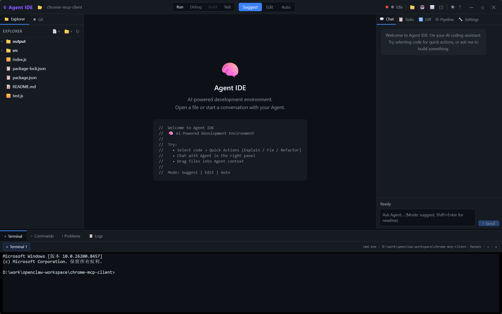

# Agent IDE

代码优先、可控、可审计的 AI Agent IDE。项目基于 Tauri v2、Rust、React、TypeScript、Tailwind CSS、Monaco Editor 和 xterm.js 构建。

Agent IDE 的目标不是做一个聊天式代码工具，而是把 Agent 放进 IDE 的核心工作流中：用户可以看到计划、角色流水线、Diff 审查、日志、Git 状态和终端执行过程，并始终保留控制权。



## 当前状态

当前阶段：**Phase 7 - Agent execution quality and auditability**。

已实现的核心能力：

- Tauri 桌面壳，React/Vite 前端，Rust 后端。
- Monaco 编辑器、文件标签、文件树、Git 面板、Terminal 面板、Logs 面板和 Agent 面板。
- 工作区范围内的文件系统操作，并带路径边界检查。
- 基于 `git2` 的 Git status/diff/stage/unstage/discard/commit/branch/fetch/pull/push 命令，Source Control 支持 staged/worktree/all diff、多选批量操作和可选的 OS-stored HTTPS remote credentials。
- 基于 `portable-pty` 的 PTY 后端和 xterm.js 前端终端。
- OpenAI 兼容的流式 LLM 客户端。
- 角色化 Agent 流水线：planner -> architect -> coder -> tester -> reviewer。
- Agent 上下文压缩模式：`full`、`focused`、`compact`。
- 支持多个 LLM provider profile，Chat 中可以选择本次使用的 provider/model 和上下文压缩模式。
- LLM API key 通过系统 credential store 保存；本地 JSON profile 配置只保留 credential 引用。
- Provider profile 可配置模型预算元数据，例如 max context、reserved output 和 max output tokens；Chat 会显示所选 profile 的估算输入预算。
- Agent context builder 会使用所选 profile 的 max context 和 reserved output 元数据进行估算式预算裁剪。
- OpenAI 兼容请求会在配置后使用所选 profile 的 max output token 限制。
- Agent 上下文增强：项目树摘要和 Git working-tree diff。
- Logs 面板中可查看结构化 Agent action log。
- Diff 审查和应用流程，支持结构化失败信息。
- 兼容式 `agent-changes` JSON 协议，同时保留旧的 diff/new-file 代码块解析。
- Agent diff 支持可选 `baseHash`，用于拒绝基于过期文件内容的编辑。
- TypeScript/JavaScript 语义能力桥接：保留 Monaco fallback，并支持 `typescript-language-server` 的 hover、completion、definition、document symbols、rename、code actions 和 diagnostics。
- Go LSP 第一版：支持 `gopls` 检测、Go 文件激活、安装指引、module/workspace indexing 状态和共享 LSP 操作。
- TopBar 可查看 language server 状态详情，包括 server/workspace 信息、安装指引、workspace indexing 模式、配置文件检测和最近 diagnostics 摘要。
- Quick Fix/code action 应用会写入 Logs，并在应用后同步编辑器状态、触发 diagnostics 刷新。
- Problems 已接入静态 diagnostics 与 terminal/test 失败；所有问题会按严重级别显示编辑器整行高亮、minimap 标记，带文件/行/列的运行时错误会同步为编辑器 marker。
- build/test/lint/check 命令会进入 command runner history，记录 exit code、耗时、输出详情、Problems 解析和失败后 Agent 修复上下文。
- Explorer 增强常用右键操作：Reveal In File Explorer、VS Code 式 Copy/Paste File、Copy File Path、Copy Relative File Path。

重要缺口：

- Git 工作流还缺更好的 SSH/passphrase UX 和更完整的 merge editor 控制。
- LSP 仍需要在更大的 TypeScript 和 Go workspace 中验证，并继续增加 Rust/Python adapters。
- Agent change protocol 还需要更严格的 schema 校验和更完整的 provenance。
- LLM credential storage 还需要在 Windows Credential Manager、macOS Keychain 和 Linux secret service 上做真实运行时验证。
- Terminal 还需要在真实 Tauri runtime 中针对面板隐藏/显示、工作区切换和长运行进程做更多交互测试。
- 前端测试和 Tauri smoke tests 仍然不足。

实现状态以 [ROADMAP.md](ROADMAP.md) 为准，详细设计见 [docs/agent_ide_design.md](docs/agent_ide_design.md)，真实运行时回归清单见 [docs/smoke_test.md](docs/smoke_test.md)。

## 运行模式

项目有两种开发运行方式。

```powershell
npm run dev
```

只运行 Vite Web 预览。Tauri IPC、文件系统、终端、Git 和 Agent 后端功能会被禁用或通过 runtime guard 保护。

```powershell
npm run tauri -- dev
```

运行真实桌面 IDE，包含 Rust 后端和 Tauri API。

## 环境准备

需要：

- Node.js 和 npm
- Rust toolchain
- 当前系统所需的 Tauri v2 依赖

安装依赖：

```powershell
npm install
```

运行 Web 预览：

```powershell
npm run dev
```

运行桌面应用：

```powershell
npm run tauri -- dev
```

## 验证命令

提交较大改动前运行：

```powershell
npm run build
npm test
cd src-tauri
cargo check
cargo test
```

已知情况：Vite 目前会提示前端 chunk 较大，因为 Monaco、Markdown、xterm 和语法高亮工具打在一起。这不是正确性失败，后续需要做 code splitting。

如果改动涉及 LSP、Problems、Terminal、Git 或 Agent diff application，还需要按 [docs/smoke_test.md](docs/smoke_test.md) 执行真实 Tauri runtime 回归。

## 项目结构

```text
src/
  components/
    agent/       Agent chat、task、diff、pipeline、settings UI
    editor/      Monaco editor、tabs、overlays、quick actions
    layout/      顶部、左右、底部布局面板
    panels/      Explorer、Git、Terminal、Logs
  hooks/         Tauri event bridge 和快捷键
  stores/        Zustand stores
  types/         前端 DTO 类型
  utils/         Tauri runtime helper

src-tauri/
  src/
    agent/       planner、executor、orchestrator、diff apply、roles
    commands/    fs/git/terminal/agent 的 Tauri IPC 命令
    services/    workspace、context、LLM client
    bin/         agent_cli

docs/
  agent_ide_design.md      当前详细设计
  agent_cli_manual.md      CLI 模式使用说明和限制
  agent_ide_plan.md        原始技术计划
  agent_ide_ui_design.md   产品 UI 目标设计
```

## Agent 工作流

Agent IDE 以 Chat 作为用户入口，但 Agent 不是单轮自由聊天，而是由 IDE runtime 调度的可审计执行链路。

```text
Chat prompt
  -> ChatView 收集 prompt、active file、selection 和附加上下文文件
  -> useAgentStore.sendPrompt() 通过 Tauri IPC 调用 send_agent_prompt
  -> commands/agent.rs 构建 AgentContext 并读取当前 pipeline 配置
  -> services/context.rs 补充并压缩上下文
  -> agent/orchestrator.rs 运行 Agent 状态机
  -> planner 生成任务步骤
  -> role pipeline 按配置执行阶段
     -> architect
     -> coder
     -> tester
     -> reviewer
  -> executor 通过 services/llm_client.rs 流式调用模型
  -> diff parser 将模型输出转换为 pending diffs
  -> reviewer 接收实际 pending diff 摘要进行审查
  -> useAgentBridge 接收后端事件并刷新 Chat/Tasks/Pipeline/Diff/Logs
  -> 用户通过 commands/agent.rs 和 agent/diff_apply.rs apply/reject diffs
```

主要调度模块：

| 层级 | 模块 | 职责 |
|------|------|------|
| UI | `src/components/agent/*` | Chat 输入、任务视图、流水线视图、Diff 审查、设置。 |
| 前端状态 | `src/stores/useAgentStore.ts` | Agent 状态、IPC 调用、消息、步骤、diff、pipeline 配置。 |
| 事件桥接 | `src/hooks/useAgentBridge.ts` | 监听后端事件并写入 Zustand stores。 |
| IPC 边界 | `src-tauri/src/commands/agent.rs` | 校验请求、构建上下文、启动/停止 Agent、应用/拒绝 diff。 |
| 上下文 | `src-tauri/src/services/context.rs` | 组合 active file、selection、open files、project tree、Git diff 和压缩模式。 |
| 编排 | `src-tauri/src/agent/orchestrator.rs` | 运行 planner、角色阶段、reviewer、action log 和状态转换。 |
| 角色执行 | `src-tauri/src/agent/executor.rs` | 构造角色提示词，调用 LLM 并流式返回。 |
| LLM | `src-tauri/src/services/llm_client.rs` | OpenAI 兼容的流式 chat client。 |
| Diff 应用 | `src-tauri/src/agent/diff_apply.rs` | 在 workspace 边界内应用可审查文件改动。 |

上下文压缩模式在 Agent 面板的 Settings tab 中配置：

| 模式 | 用途 |
|------|------|
| `focused` | 默认实用模式：selection、active-file excerpt、project summary、Git diff。 |
| `compact` | 低 token 模式：用 outline 和 metadata 表达更宽的上下文。 |
| `full` | 高保真模式：尽量包含完整 active context，适合准确性优先的任务。 |

Agent 事件会流式回传给前端和 action log：

- `agent-state-changed`
- `agent-stream-token`
- `agent-plan-ready`
- `agent-step-update`
- `agent-pipeline-update`
- `agent-diff-ready`
- `agent-action-log`

完整设计见 [docs/agent_ide_design.md](docs/agent_ide_design.md)，重点阅读 4.3 Agent Prompt、4.4 Agent Pipeline、5 Context Model、6 Agent Modes and Safety。

## Agent Change Protocol

推荐的结构化输出：

````text
```agent-changes
{
  "changes": [
    {
      "type": "edit",
      "file": "path/to/file",
      "baseHash": "optional current file hash when known",
      "rationale": "why this change is needed",
      "hunks": [
        { "original": "exact existing code", "updated": "replacement code" }
      ]
    },
    {
      "type": "create",
      "file": "path/to/new-file",
      "rationale": "why this file is needed",
      "content": "complete file content"
    }
  ]
}
```
````

旧的 `diff:path` 和 `new:path` 代码块仍然兼容。

## 配置

LLM 配置可以通过 UI 或环境变量提供：

```powershell
$env:LLM_ENDPOINT = "https://api.openai.com/v1"
$env:LLM_API_KEY = "..."
$env:LLM_MODEL = "..."
```

当前本地配置默认保存在 `~/.agent-ide`，除非设置了 `AGENT_IDE_CONFIG_DIR`。

## CLI

Rust 侧包含一个 headless 预览/应用模式的 CLI：

```powershell
cd src-tauri
cargo build --bin agent_cli --release
target\release\agent_cli --help
```

CLI 模式适合脚本化的一次性 Agent 运行和后端 smoke check，但它还不是完整的命令行 IDE 替代方案。它目前没有桌面 IDE 中的可视化 Agent Plan 控制、Problems/Terminal/Git 闭环、LSP 能力、Run History 或 per-hunk review UI。

使用方式、安全注意事项和当前完成度见 [docs/agent_cli_manual.md](docs/agent_cli_manual.md)。

## Git 注意事项

仓库中可能存在本地 demo 改动。提交前先检查：

```powershell
git status --short
```

不要把无关 demo/workspace 改动带进功能提交。
